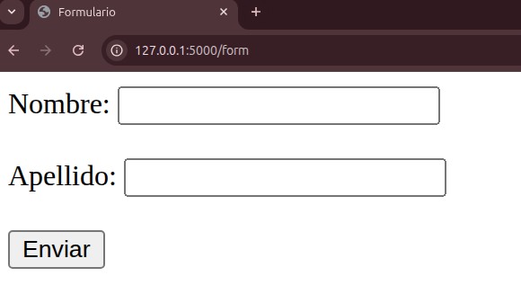
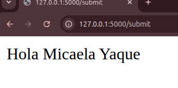
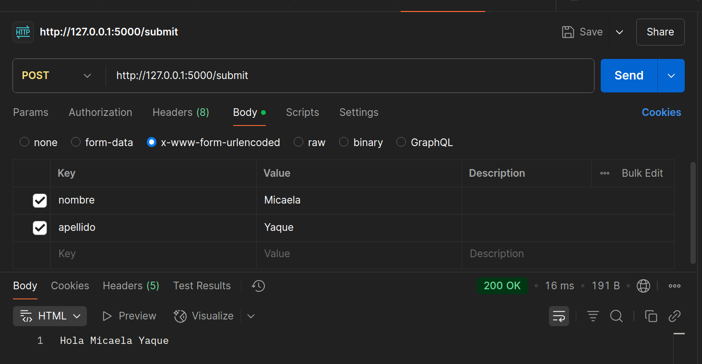

## Presentación con Formulario

Construye un formulario **HTML** simple que envíe datos por **POST**. El backend recibirá nombre y apellido y responderá con un mensaje.

* Crear plantilla en `templates/form.html`.

```html
<form action="/submit" method="post">
    <label for="nombre">Nombre:</label>
    <input type="text" name="nombre" required>
    <br><br>
    <label for="apellido">Apellido:</label>
    <input type="text" name="apellido" required>
    <br><br>
    <button type="submit">Enviar</button>
</form>
```

* Configurar ruta `GET` para mostrar el formulario y `POST` para procesar datos.

```python
@app.route('/form', methods=['GET'])
def mostrar_form():
    return render_template('form.html')
```


```python
@app.route('/submit', methods=['POST'])
def procesar_datos_form():
    nombre = request.form['nombre']
    apellido = request.form['apellido']
    return f'Hola {nombre} {apellido}'
```


* Probar envío en **Postman** enviando un cuerpo `raw` de tipo `application/x-www-form-urlencoded`.

