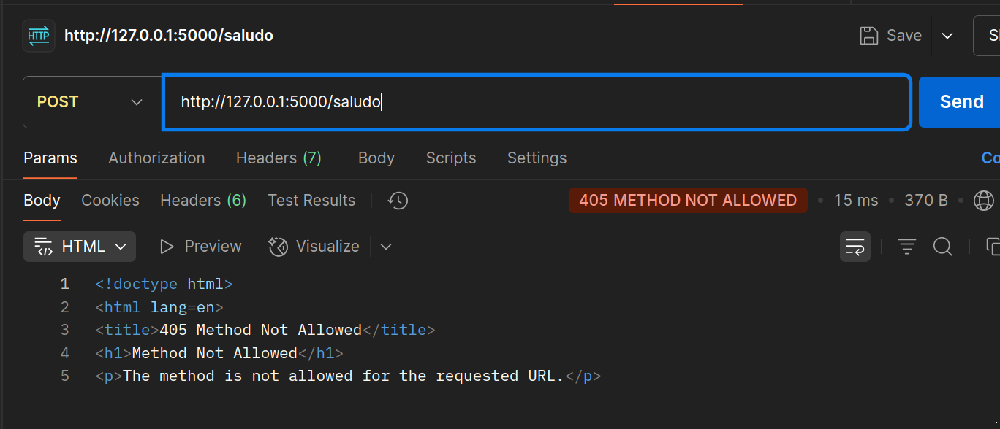
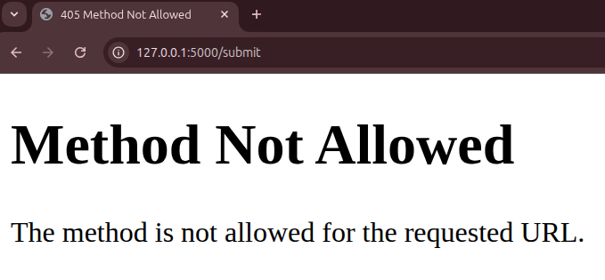

## Verbos Incorrectos

Experimenta errores de método. 

Intentar usar **POST** en rutas **GET** y viceversa para observar cómo Flask maneja los métodos no permitidos.

* Enviar una petición **POST** a `/saludo`.

* Enviar una petición **GET** al endpoint que procesa el formulario.

* Anotar los códigos de error (`405` **Method Not Allowed**).

En **Flask**, cada *ruta* define explícitamente qué **métodos HTTP** están habilitados. Si una ruta no admite el método que se utiliza, el servidor responde con el código HTTP `405`, que significa **“Método no permitido”**.

Esto es clave para el diseño de *APIs RESTful* robustas, donde cada recurso debe exponer solo los métodos apropiados para evitar operaciones inesperadas o inseguras.