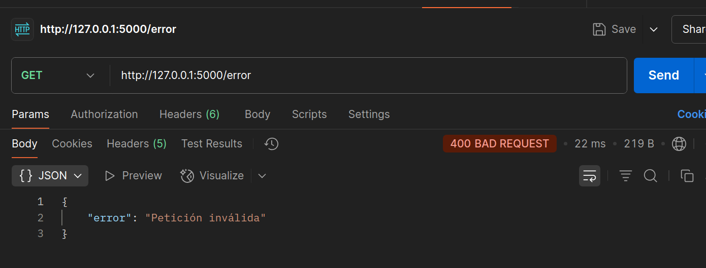
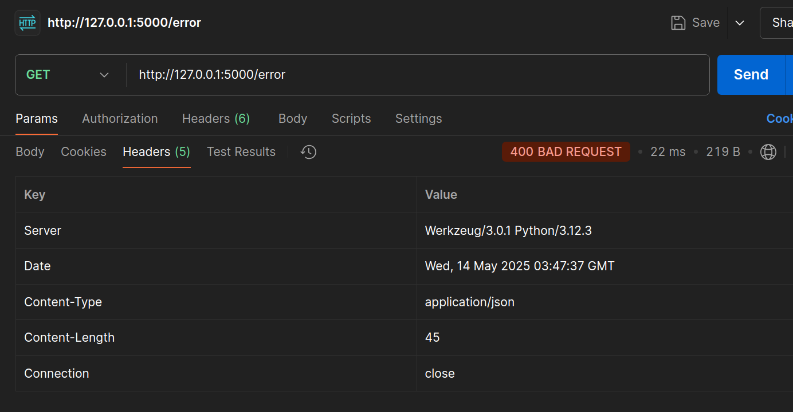

## Status Codes Personalizados

Aprende a devolver **códigos de estado** específicos. 

Crea una **ruta** `/error` que siempre responda con `400 Bad Request` y un mensaje de error en `JSON`.

* Implementar `return jsonify({ "error": "Petición inválida" }), 400`.

```python
@app.route('/error')
def error():
    return jsonify({"error": "Petición inválida"}), 400
```

* Probar la ruta en **Postman** y verificar el header `Content-Type:
application/json`.





Un **código de estado HTTP** es una forma en que el servidor dice cómo salió la respuesta.

* `200 OK`: Todo bien.
* `400 Bad Request`: El cliente envió algo inválido.
* `404 Not Found`: No se encontró la ruta.
* `500 Internal Server Error`: Algo se rompió en el servidor.

En este ejercicio, **400 Bad Request**, indica que el servidor detectó un error del lado del cliente.