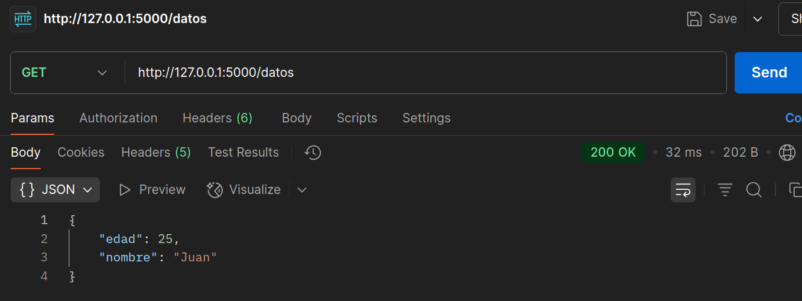
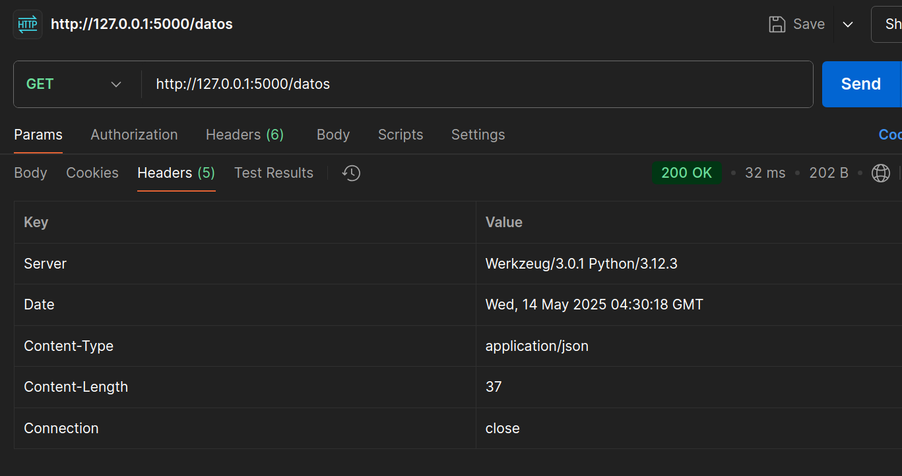

## JSON Básico

Crea un endpoint `/datos` que devuelva un objeto `JSON`estático. 

Verás cómo Flask serializa datos.

* Utilizar `jsonify` para enviar `{ "nombre": "Juan", "edad": 25
}`.

```python
@app.route('/datos')
def datos():
    persona = {
        "nombre": "Juan",
        "edad": 25,
    }
    return jsonify(persona)

if __name__ == '__main__':
    app.run(debug=True)
```



* Verificar que `Content-Type` sea `application/json`.

