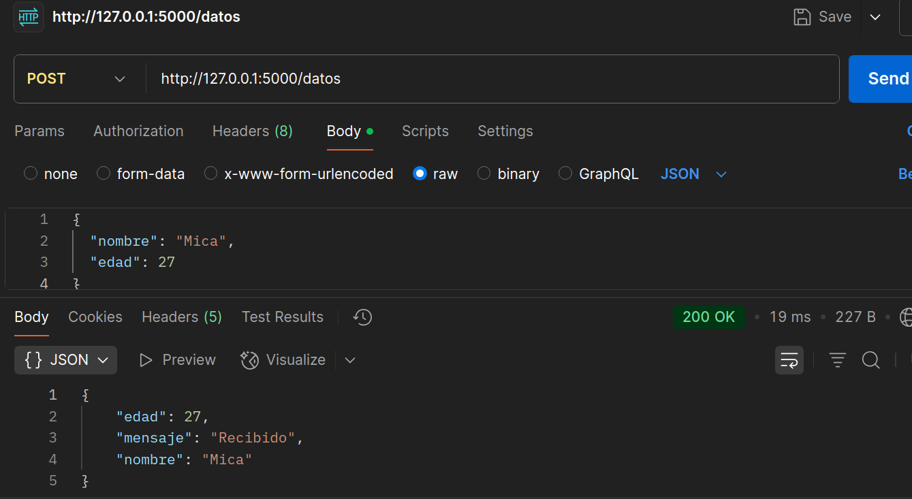

## JSON Dinámico

Procesa **JSON** entrante. 

El endpoint recibirá un JSON con
nombre y edad, y responderá añadiendo un campo mensaje.

* En **Postman**, enviar **JSON raw** a `/datos` con método **POST**.



* Leer `request.get_json()` y devolver
`data.update({"mensaje": "Recibido"})`.

`request.get_json()` $\text{es un método de }\textcolor{violet}{Flask} \text{ que se usa para }\textcolor{violet}{\text{leer el cuerpo de una petición POST que tiene formato JSON.}}$

```python
@app.route('/datos', methods=['POST'])
def procesar_datos():
    data = request.get_json()
    data.update({"mensaje": "Recibido"})
    return jsonify(data)
```