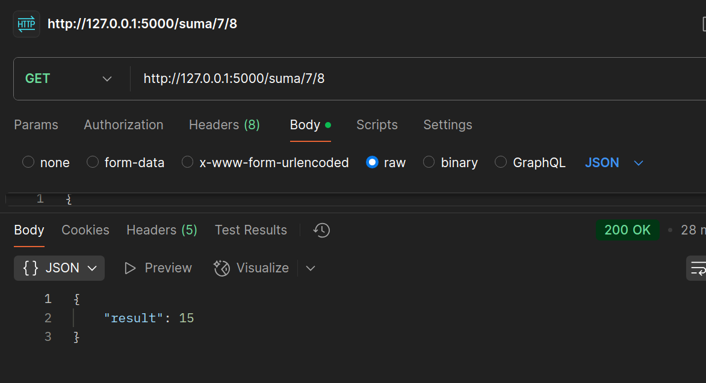
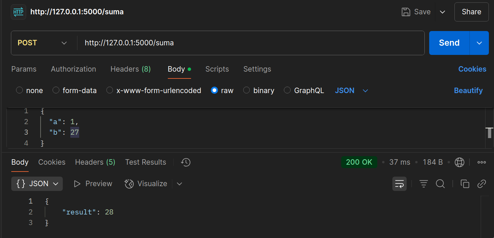

## URI vs Body

Compara dos formas de recibir datos: vía **URI** y vía **body JSON**.

* Crear `/suma/<int:a>/<int:b>` para sumar parámetros de ruta.

```python
@app.route('/suma/<int:a>/<int:b>')
def suma_uri(a, b):
    resultado = a + b
    return jsonify({'result': resultado}), 200
```



* Crear `/suma (POST)` que lea **JSON** con `a` y `b` y devuelva la suma.

```python
@app.route('/suma', methods=['POST'])
def suma():
    data = request.get_json()
    if 'a' in data and 'b' in data:
        a = data['a']
        b = data['b']
        result = a + b
        return jsonify({'result': result}), 200
    else:
        return jsonify({'error': 'Datos inválidos'}), 400
```

